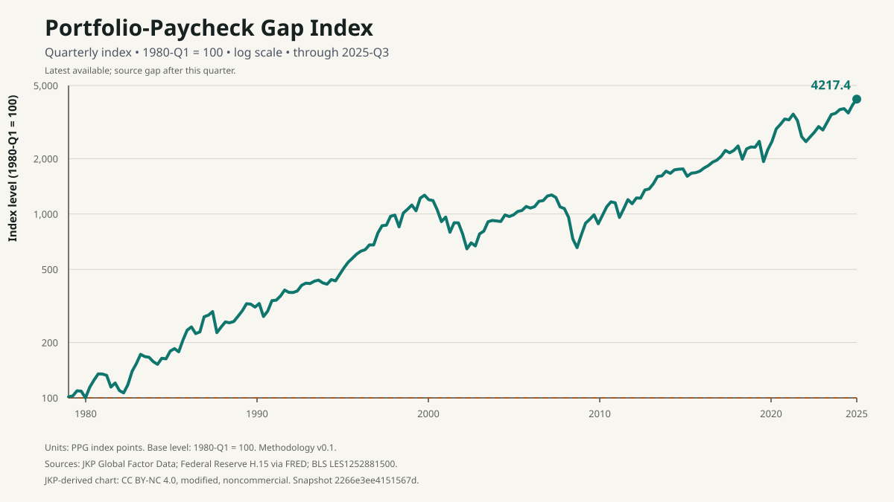

# Portfolio–Paycheck Gap Index

> How has the growth of a broad US stock-market investment compared with the
> growth of the median full-time paycheck since 1980?

The **Portfolio–Paycheck Gap Index (PPG)** compares those two growth paths each
quarter. It is an index of relative growth—not a dollar gap, percentage gap,
valuation signal, or measure of what a typical worker owns.

## Current reading

| Through | PPG | Quarter over quarter | Year over year | Status |
| --- | ---: | ---: | ---: | --- |
| **2025 Q3** | **4,217.4** | **+7.6%** | **+14.0%** | **Stale** |

> **Freshness note:** this is the latest quarter with both market and paycheck
> data in the reviewed snapshot. Market data extend further, but the required
> BLS paycheck observation for 2025 Q4 was not produced. PPG retains 2025 Q3
> rather than estimating the missing value.



## How to read PPG

- **100 is the 1980 Q1 baseline.** Both growth factors are rebased to 100.
- **Above 100 means market wealth grew faster.** A hypothetical PPG of 150
  means the market growth factor was 1.5 times the paycheck growth factor since
  the base quarter. It does not mean stocks are 50% overvalued or pay is 50%
  too low.
- **Below 100 means paychecks grew faster.** A hypothetical PPG of 80 means the
  market growth factor was 0.8 times the paycheck growth factor over the same
  span.

At 2025 Q3, the market component was 20,173.8 and the paycheck component was
478.3. In growth-factor language, the selected market series had compounded to
about 201.7 times its base value while the median weekly paycheck was about
4.78 times its base value. Their ratio is 42.17, reported as **4,217.4 index
points**.

The **level** answers the since-1980 question. The **quarterly change** compares
the level with the previous quarter; the **annual change** compares it with the
same quarter one year earlier. Neither change is a stock return or a change in
pay by itself.

Read the [interpretation guide](docs/interpretation-guide.md) for worked
examples, comparison rules, and language suitable for reporting.

## What PPG does not say

PPG compares a hypothetical broad-market investment with a cross-sectional
earnings statistic. It does **not** imply that the median worker owns that
portfolio or track the same people through time. It is not:

- a valuation, market-timing, recession, or return forecast;
- a cost-of-living, affordability, household-wealth, or retirement-readiness
  measure;
- a complete measure of income or wealth inequality; or
- evidence of a socially optimal level or a cause of the observed divergence.

The market proxy, reconstructed risk-free return, paycheck population, sampling
error, composition changes, revisions, and differing within-quarter timing all
matter. See the [full limitations](methodology/v0.1.md#9-limitations) before
drawing conclusions.

## Data and methodology

| Resource | Purpose |
| --- | --- |
| [Historical CSV](public/data/ppg.csv) | All quarterly observations and component paths |
| [Latest reading](public/data/latest.json) | Machine-readable current value, changes, freshness, and version |
| [Provenance record](public/data/provenance.json) | Snapshot ID, retrieval times, checksums, source identities, and rights notice |
| [Methodology v0.1](methodology/v0.1.md) | Normative definition, calculation, validation, and limitations |
| [Data dictionary](methodology/data-dictionary-v0.1.md) | Input, intermediate, output, and metadata fields |
| [Reference notebook](notebooks/ppg_reference.ipynb) | Independently executable calculation |
| [Sensitivity analysis](methodology/sensitivity-analysis.md) | Failure policy and material methodological choices |
| [Static site source](site/index.html.template) | Generated, dependency-free public interface |
| [Release v0.2.1](releases/v0.2.1.md) | Corrected reproducible data release and notes |

Canonical sources are Jensen, Kelly, and Pedersen's US value-weighted market
portfolio, the Federal Reserve's 3-month Treasury bill series, and the Bureau
of Labor Statistics series for seasonally adjusted median usual weekly
earnings of full-time wage and salary workers. The exact series and proxy
boundaries are versioned in the methodology.

## Formula

```text
MARKET_t   = 100 × market wealth_t / market wealth_1980-Q1
PAYCHECK_t = 100 × median paycheck_t / median paycheck_1980-Q1

PPG_t      = 100 × MARKET_t / PAYCHECK_t
```

Both nominal components share the same base. Applying one positive price index
to both would cancel in their ratio, so the headline does not require a separate
inflation adjustment.

## Reproduce and validate

Install the exact development environment with
[uv](https://docs.astral.sh/uv/), then reproduce the committed artifacts from
the reviewed local source snapshot without network access:

```sh
uv sync --locked --all-groups
make reproduce
```

Run every repository quality gate:

```sh
make check
```

Preview the generated static interface at `http://localhost:8000`:

```sh
make preview
```

To retrieve live inputs into an ignored review workspace without publishing
them, run `uv run ppg fetch --cache-dir data/cache`. A changed source vintage
is quarantined for explicit review; it never silently redefines the index. See
the [contribution workflow](CONTRIBUTING.md) for branch, commit, and Cairn
standards.

## Cite

Cite a named release so the data vintage is unambiguous. For the current
release:

> Portfolio–Paycheck Gap Index, v0.2.1, methodology v0.1, snapshot
> `2266e3ee4151567d`, 2026-09-18,
> <https://github.com/oddurs/portfolio-paycheck-gap/releases/tag/v0.2.1>.

Include the retrieval date and underlying source attributions when republishing
data or charts. The [provenance record](public/data/provenance.json) supplies
those details.

## Data use

The selected JKP market data is CC BY-NC 4.0. PPG datasets and charts derived
from it are therefore limited to noncommercial use unless a replacement source
or separate permission is obtained. Federal Reserve and BLS attribution rules
also apply. See [data licensing and attribution](DATA_LICENSE.md).

No license is granted for repository code unless and until a code license is
added explicitly.

The roadmap and milestone state live in plain Markdown through
[Cairn](https://github.com/oddurs/cairn): run `cairn roadmap` or `cairn next`.
